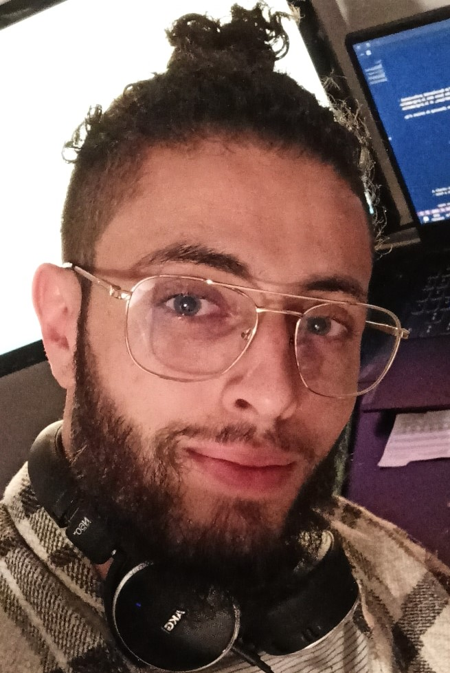

# Tom Bouiche

_Junior Developer based in France_  

[Email](mailto:tom.bouiche@outlook.fr) / [Website](https://inWorking.com/) / [LinkedIn](https://www.linkedin.com/in/bouiche-tom-8361b8166/) / [GitHub](https://github.com/Tomybch) / [Twitter](https://twitter.com/Tom_Bouiche) / [DEV](https://dev.to/TomyBch/)
   

## 🧔 My journey from Electronics to Web Development
 

**👨‍🎓SEN (Sytèmes Electroniques Numériques) baccalaureate** @ [EME School] _(Sep 2011 - Jul 2014)_  
  - structure of a network, notions of electricity (the different laws, weak and strong current...)
  - read an electronic plan, knowledge of electronic components...
  - welding, electronic device cable, preventive and curative maintenance...
      
    
**👨‍🎓BTS SN IR( Systèmes Numériques Informatique et Réseaux)** @ [EME School] _(Sep 2016 - Jul 2018)_  
  - Algorithms / Physics / English / Economics and Management
  - Data communication networks and their security / Design, Deployment and Configuration of Computer Networks (VLAN, routing, firewall, etc.)
  - Embedded Systems / Hardware Architecture of Computers and Microcontrollers / Industrial networks (Modbus, CAN…) / Server virtualization, hypervisor...
  - Digital processing (sounds and images) / Basics of telecoms (signal, filtering, transmission, antennas, etc.)
    

**🙇‍♀️Open Class Room** @ [OCR](https://openclassrooms.com/fr/paths/556-developpeur-web) _(Jan 2021 - Jul 2021)_  
  - learned the basics of web development, which are HTML, CSS and JavaScript.
  - Improved my Front-End skills, with courses on Sass and Bootstrap
  - Built my Back-End knowledge with PHP
  

**🙋‍♀️Udemy courses :** @ [Udemy](https://www.udemy.com/course/the-complete-javascript-course/) _(Aug 2021 - Mar 2022)_  
The Complete JavaScript Course 2022: From Zero to Expert!| PHP for Beginners - Become a PHP Master - CMS Project 

  **_JavaScript Spécialisation:_**
  - To build solid knowledge in JavaScript because it is essential, I learned to master and understand many notions such as Data Structure, Functions, Arrays, DOM,         OOP, Mapty, Asynchronous, Modern-JS-Modules-Tools...

  **_PHP Spécialisation:_**
  - Learned to create a (CMS) Content Management System like WordPress, Drupal or Joomla, 
  - Using MYSQL database
  - How to launch your application online
  - How to use AJAX to submit data to the server without refreshing the page
  - PHP security / Password hashing / use composer (PHP package manager) / use API's...
  

**🙋‍♂️O'Clock Student** @ [O'Clock](https://oclock.io/formations/developpeur-web) _(Mar 2022 - Present)_  
The Best Adventure ever to touch my goal 🎯 and to get an official Professional title recognized by the State 🎓 .
This will be all the knowledge to be a passionate and autodidacte Developer Web 🎊
  - Linux / HTML / CSS  / Git
  - PHP / ClientServeur
  - JavaScript / DOM
  - POO /SQL / RWD / Bootstrap
  - MVC/ Composer / SEO / GitAvancé
  - BackOffice / Sécurity
  - Framework / ORM / API / AJAX
  - Adminsys / SSH / Deploy / CMS
  - SYMFONY in spécialisation
      

## 🏆 Web Accomplishments

**Won Best Project** @ [////////////////](////////////////]) _(////////////////])_ 
////////////////
  

**Won Best Project** @ [////////////////](////////////////]) _(////////////////])_ 
////////////////
  

**Won Best Project** @ [////////////////](////////////////]) _(////////////////])_ 
////////////////
  

## 💬 Languages

**English**: B1  / **French**: Native
  

## 📌 On The Side

**⛵Travel lover** @ [My Instagram](https://www.instagram.com/krambo_bch/?hl=fr)  
 “There’s a sunrise and a sunset every single day, and they’re absolutely free. Don’t miss so many of them” 
    
**📸photo addict** 
“We take photos as a return ticket to a moment otherwise gone” 
    
**🕹Video games** 
“I don’t need to get a life, I am a gamer, I have lots of lives”
    
**⚾Sport** 
I always felt that my greatest asset was not my physical ability, it was my mental ability"
      
  
